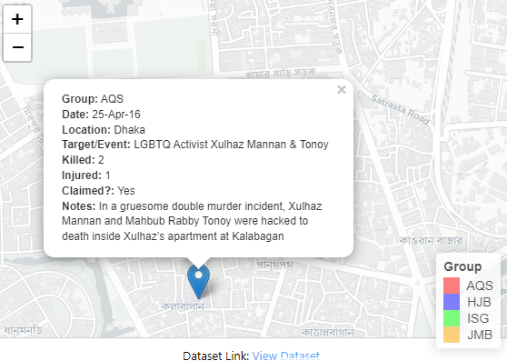

# Terrorism Incidents in Bangladesh: Interactive Map Visualization

This project visualizes terrorism incidents in Bangladesh using an interactive Leaflet map. The map includes clustered markers and a heatmap to represent the intensity of incidents based on casualties (killed and injured). The dataset is sourced from a Google Sheet, and the map is saved as an interactive HTML file.

## Features
- **Marker Clustering**: Groups nearby incidents into clusters for better visualization.
- **Heatmap**: Represents the intensity of incidents based on casualties.
- **Interactive Popups**: Displays detailed information about each incident, including group, date, location, casualties, and notes.
- **Dataset Link**: A footer in the HTML file provides a link to the dataset for easy access.

## Requirements
To run this project, you need the following R packages:
- `dplyr`
- `leaflet`
- `leaflet.extras`
- `tidygeocoder`
- `htmltools`
- `htmlwidgets`
- `tidyverse`
- `ggmap`
- `httr`
- `jsonlite`
- `remotes`

If these packages are not installed, the script will automatically install them.

## Dataset
The dataset is hosted on Google Sheets and contains the following columns:
- **Longitude**: Longitude of the incident location.
- **Latitude**: Latitude of the incident location.
- **Group**: Group responsible for the incident.
- **Date**: Date of the incident.
- **Location**: Location of the incident.
- **Target.Event**: Target or type of event.
- **Killed**: Number of people killed.
- **Injured**: Number of people injured.
- **Claimed.**: Whether the incident was claimed by a group.
- **Notes**: Additional notes about the incident.

You can access the dataset here: [Dataset Link](https://docs.google.com/spreadsheets/d/e/2PACX-1vROsLYRpCh6rUAQFbNcXtTHKpeFFPyWzlQmniXa1DL7BVKeeHkl8-Ml-924kHzpRiUV__q0lD8C10FZ/pubhtml).

## How to Run the Code
1. **Install R**: Ensure you have R installed on your system. You can download it from [here](https://cran.r-project.org/).
2. **Install RStudio (Optional)**: For a better experience, use RStudio, which can be downloaded from [here](https://www.rstudio.com/products/rstudio/download/).
3. **Run the Script**:
   - Copy the provided R script into an R file (e.g., `terrorism_map_bd.R`).
   - Open the file in R or RStudio and run the script.
4. **Output**:
   - The script will generate an interactive HTML file named `cluster_map.html`.
   - Open this file in a web browser to view the map.

## Code Overview
The script performs the following steps:
1. Installs and loads required R packages.
2. Reads the dataset from the Google Sheet.
3. Checks for required columns in the dataset.
4. Creates an interactive Leaflet map with:
   - Marker clusters for incidents.
   - A heatmap to visualize the intensity of incidents.
   - A legend to differentiate groups.
5. Adds a footer to the map with a link to the dataset.
6. Saves the map as an HTML file.

## Output
The output is an interactive HTML file (`index.html`) that includes:
- A map centered on Bangladesh.
- Clustered markers for incidents.
- A heatmap showing the intensity of incidents.
- A legend for groups.
- A footer with a link to the dataset.

## Example Screenshot
 *(Replace this with an actual screenshot of your map if available.)*

## License
This project is licensed under the MIT License. See the [LICENSE](LICENSE) file for details.

